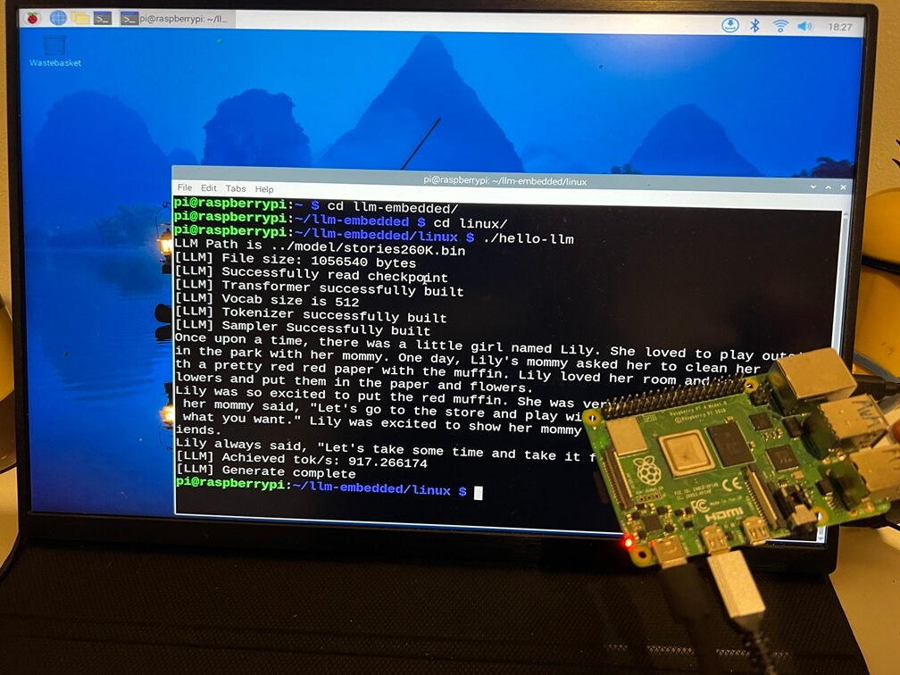

# LLM Embedded

| Hardware    | CPU | OS | Storage |Benchmark |
| -------- | ----- | ------- | --- | -- |
| K210  | 400 MHz | FreeRTOS | SD Card |  43.83 token/s |
| ESP32 | 240 MHz | FreeRTOS | SPIFFS   | 25.30 token/s |
| Raspi4 | 1.5GHz | Linux    | SD Card | 917.30 token/s |

> Kendryte K210


> ESP32-S3


> Raspberry Pi 4



## K210 (RISC-V 64-bit)

### Prerequisites

Download and install latest CMake.

[Download cmake-3.14.1-win64-x64.msi](https://github.com/Kitware/CMake/releases/download/v3.14.1/cmake-3.14.1-win64-x64.msi)

Download and install the latest toolchain.

[Download kendryte-toolchain-win-i386-8.2.0-20190409.tar.xz](https://github.com/kendryte/kendryte-gnu-toolchain/releases/download/v8.2.0-20190409/kendryte-toolchain-win-i386-8.2.0-20190409.tar.xz)

### Compile
Please remember to change SPI SD Card pin layout in `project_cfg.h`:

```
$ git clone https://github.com/wuhanstudio/llm-embedded
$ cd llm-embedded/k210/hell0_llm

# K210 FreeRTOS SDK
$ git submodule init
$ gith submodule update

$ mkdir build && cd build
$ cmake -G "MinGW Makefiles" ../
$ make
```

You can use the KFlash GUI tool to flash `hello-llm.bin` to the board.

- https://github.com/sipeed/kflash_gui

## ESP32 (Xtensa 32-bit)

Please download the ESP-IDF tool:

- https://dl.espressif.com/dl/esp-idf/

```
$ git clone https://github.com/wuhanstudio/llm-embedded
$ cd llm-embedded/esp32
$ idf.py build
$ idf.py -p COM4 flash
```

## Raspberry Pi (Linux)

```
$ git clone https://github.com/wuhanstudio/llm-embedded
$ cd llm-embedded/linux
$ make
$ ./hello-llm
```

## References

- https://github.com/karpathy/llama2.c/
- https://github.com/DaveBben/esp32-llm
  
